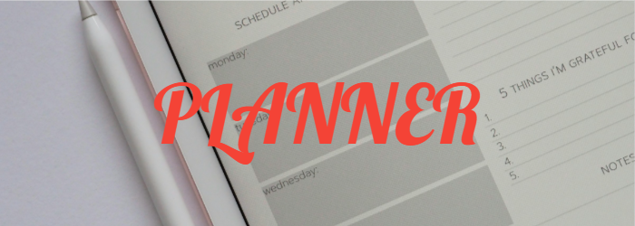

 

# List Planner

Create a list of Tasks for a Shopping List website. The information should be stored in arrray.

1. Ensure structured code identation.
2. Use bootstrap classes to implement responsiveness in the container that holds the Tasks' cards. On larger screen should have 3 columns in a row, for medium screens 2 columns and for smaller screens 1 column.
3. Html file should not be hard coded: the elements should be created through Javascript.The array (that holds all the information) should display item's name, a short description, a representative image and the priority level field with representive number.
4. On every instance the "Importance-Priority" button is clicked, the number should increase by 1 but not further than 5. Additionally the background color of this button, should change depending on the displayed number.

BOOTSTRAP COLORS:

Between 0-1 should be green;
Between 2-3 should be yellow;
Between 4-5 should be red;

5. Implement a sorting button that ordersthe cards in descending order, according to their level of importance.

